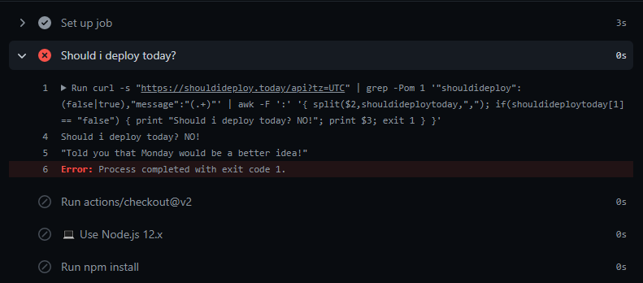

# shouldideploytoday-for-pipeline

## 🚨 What is [shouldideploy.today](https://shouldideploy.today)?

This website use your timezone to detect, when you can make deploy. If you open, in your screen you see a message about the "should i deploy today" question.

You can see website screen with red background, saying one message, to motivate you dont make deploy today. Or with a green background, with a positive message.

This example of implementation, consumes the shouldideploy.today API to decide on my pipeline if will be deploy process run or not.

# Example of usage on my pipeline



## ⚠️ Required

- [curl](https://curl.se)

## 🛠️ Configuration

- Add one command as step on your pipeline. You can call this step as `"Should i deploy today❓"`

### ➡️ This version print the result message 🤩

```bash
curl -s "https://shouldideploy.today/api?tz=UTC" | grep -Pom 1 '"shouldideploy":(false|true),"message":"(.+)"' | awk -F ':' '{ split($2,shouldideploytoday,","); if(shouldideploytoday[1] == "false") { print "Should i deploy today? NO!"; print $3; exit 1 } }'
```

Or you can use this one

### ➡️ This version only block your deploy 😀

```bash
curl -s "https://shouldideploy.today/api?tz=UTC" | grep -Po '(?!"shouldideploy":)(false|true)' | awk -F ':' '{ if($1 == "false") exit 1 }'
```

👉 Developed by [MatheusHAS](https://github.com/MatheusHAS)
